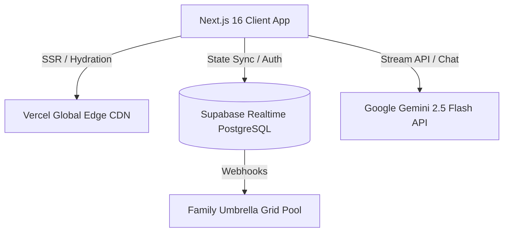

<div align="center">

# 🛡️ CYBER SIKSHA
### India's Premier Interactive AI Family Cyber Defense Ecosystem

[](https://cyber-siksha.vercel.app)
[](https://nextjs.org/)
[](https://tailwindcss.com/)
[](https://supabase.com/)
[](https://deepmind.google/technologies/gemini/)

<p align="center">
  <b>Gamified scam interception for Gen-Z • Accessible AI protection for Elders • Realtime Multigenerational Umbrella Roster</b>
</p>

</div>

---

## 🚨 The National Crisis & Our Mission

Traditional cybersecurity education fails because it relies on static, text-heavy PDFs written by IT engineers for IT engineers. In Indian households, financial security is deeply interconnected—if a 70-year-old grandfather falls for a fake electricity bill SMS and shares his bank OTP, the **entire household's life savings** can be wiped out in seconds.

**CyberSiksha** bridges the generational digital divide. We transform dry cybersecurity guidelines into an **interactive, high-retention arcade arena** that gamifies defense training for youth while building a zero-friction, protective digital umbrella over vulnerable parents and elders.

---

## ✨ Key Innovations & Features

### 🕹️ 1. Interactive Scam Interception Arena (`/quiz` & `/learn`)
* **Live Threat Grounding**: We discarded fake, generic quiz examples. CyberSiksha challenges users with real-world intercepted Indian banking frauds—from **"Digital Arrests"** and **APK Loan Apps** to **Aadhaar Biometric Cloning** and **UPI Collect Request** traps.
* **3D Perspective Card Decks**: Features custom CSS hardware-accelerated card towers that pan dynamically on cursor movement.
* **Fortune Wheel Roulette**: An interactive physics roulette wheel (`Spin Me`) that dispenses random daily fraud vectors with visual particle fireworks.

### 🛡️ 2. Multigenerational Family Defense Grid (`/family`)
* **The Umbrella Concept**: Allows one tech-savvy household member ("Circle Commander") to create a secure cloud group linked via a 6-character cryptographic invite code.
* **One-Click WhatsApp Onboarding**: Grandparents hate complex app sign-ups. Commanders dispatch a direct access link via WhatsApp. Elders tap the link, pick their relationship tier, and connect to the family grid in 5 seconds—**zero password friction**.
* **Realtime Cloud Synchronization**: Powered by **Supabase Realtime**. Whenever an elder completes a protocol lesson or spots a scam, their earned **Clearance XP (+50 XP)** and daily safety streak automatically sync to the household roster.

### 🤖 3. Generative AI Cyber Companion (`/chat`)
* **Powered by Google Gemini (`gemini-2.5-flash`)**: Instead of rigid FAQ scripts, users converse with a live AI cyber sentinel.
* **Contextual Indian Advisory**: Gemini dynamically simulates scam interceptions, explains complex financial threats in plain Indian English/Hindi context, and advises families on emergency freezing protocols (1930 helpline) instantly.

### 🗞️ 4. The Cyber Sentinel Intelligence Chronicle (`/news`)
* **Authentic Editorial Experience**: Synthesizes genuine **CERT-In advisories, RBI annual reports, and I4C police case FIRs** into high-luxury digital newspaper dispatches featuring calligraphy drop-caps and classified pull-quotes.
* **True Window Viewport Portals**: Built with React DOM `createPortal` to ensure all intelligence dossiers pop up dead-center in the monitor window with zero layout shifting or bottom scroll voids.

---

## 🏗️ Technical Architecture & Tech Stack



* **Frontend**: Next.js 16 (App Router + Turbopack), React 19, Tailwind CSS, Lucide Icons, Canvas Confetti.
* **Backend & Cloud**: Supabase (PostgreSQL, Row-Level Security, Realtime Broadcast Channels).
* **AI Intelligence**: Google Gemini API (`@google/genai` SDK).
* **UI/UX Engineering**: Deep-space glassmorphism (`backdrop-blur-2xl`), HSL color design system, viewport overlay encapsulation.

---

## 🚀 Quickstart & Local Setup

### 1. Clone Repository
```bash
git clone https://github.com/Srishti-Gupta74/CyberSiksha.git
cd cybersiksha
```

### 2. Install Dependencies
```bash
npm install
```

### 3. Configure Environment Variables
Create a `.env.local` file in the root directory and add your cloud service keys:

```env
NEXT_PUBLIC_SUPABASE_URL=your_supabase_project_url
NEXT_PUBLIC_SUPABASE_ANON_KEY=your_supabase_anon_key
GEMINI_API_KEY=your_google_gemini_api_key
SUPABASE_SERVICE_ROLE_KEY=your_supabase_service_role_key
```

### 4. Launch Development Server
```bash
npm run dev
```
Navigate to `http://localhost:3000` to inspect the platform.

---

## 🔮 Strategic Engineering Roadmap

* [ ] **Enterprise Biometric Passkeys (WebAuthn)**: Transitioning prototype open-access invite links to hardware device passkeys (FaceID / Fingerprint) and WhatsApp OTP verification for production elder onboarding.
* [ ] **Chakshu API Integration**: Direct API hook into Sanchar Saathi Department of Telecommunications for automated reporting of suspicious WhatsApp numbers.
* [ ] **Vernacular Voice Agents**: Text-to-speech AI audio narration in regional languages (Marathi, Tamil, Bengali) for non-literate rural citizens.

---

<div align="center">
  <p>Crafted with ❤️ for India's Digital Sovereignty • Hackathon Championship Edition</p>
  <p><b>Helpline Grounding: Dial 1930 for National Cyber Crime Emergency</b></p>
</div>
